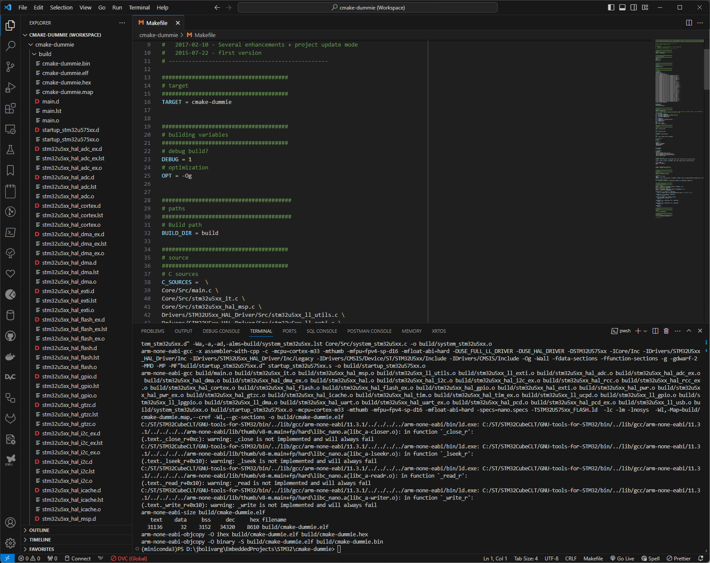

# Create new STM32 Project

Create the project directory and open it on VSCODE and save the Workspace, save it is optional but is helpful to isolate the workspace environment setup.

Select the STM32 Extension on the left panel.

On the Project Manager section select "*Create a new application project*"

This will open the STM32CubeMX environment to create a new STM32 project, on the "*I Need to*" section you can select if you need create the project based on the MCU, a development board or one example.

On this case I'm using the [NUCLEO-U575ZI-Q](https://www.st.com/en/evaluation-tools/nucleo-u575zi-q.html) development board.

At the "*I Need To*" section I select "*Access to Boad Selector*" and that will open a new windows to select the board used on the project.

After select the MCU to use, or on this case the board, click on "*Start Project*" and this will open STM32CubeMX to setup the MCU hardware.

On this windows all the pins, clocks and other specific hardware setups needs to be done.

On the "*Project Manager*" tab the environment needs to be configured.

At the "*Project*" section is important to set the "*Project Name*", "*Project Location*" and on the "*Toolchain/IDE*" select '**Makefile**' option.

On the "*Code Generator*" section select "*Copy only the necessary library files*"

On this sections all the specific project's configurations needs to be done, this are the basic setup at a STM32 Makefile project.

To generate the code click on "*Generate Code*" and all the code skeleton will be generated on the project folder.

After this a Makefile is create on the project's root workspace, including all the files required to create the project.

on VSCODE open a new terminal and excecute "**make all**" on the project's root directory, a '*build*' directory should be created and on it all the compile objects and the .bin, .elf, .hex and .map files.

On this way the STM32 project skeleton was created to use Makefiles to build it.
