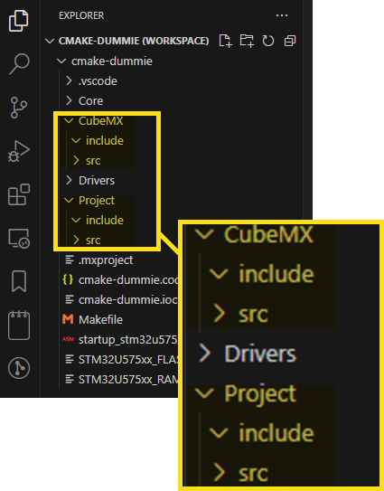
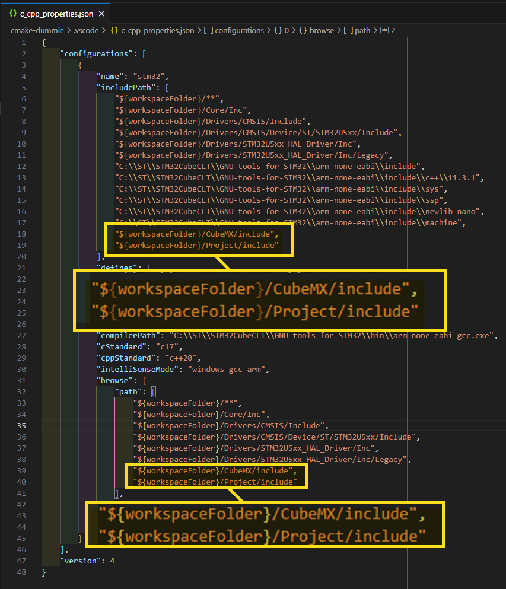
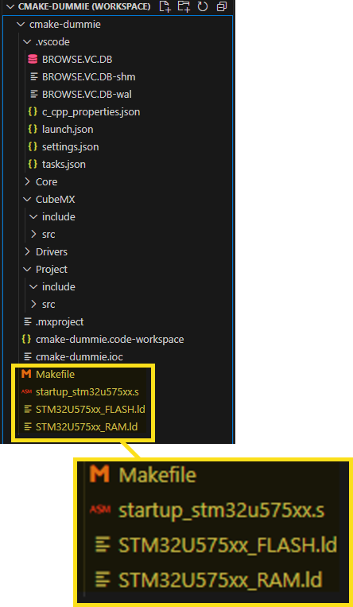
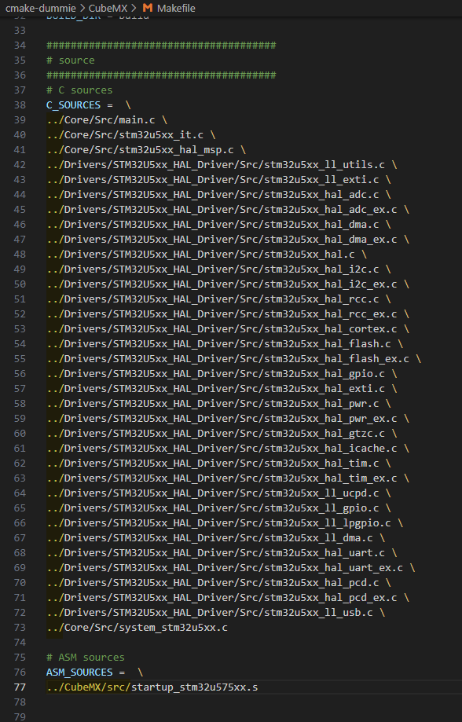
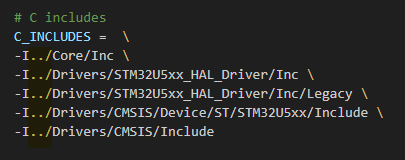
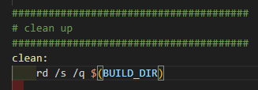
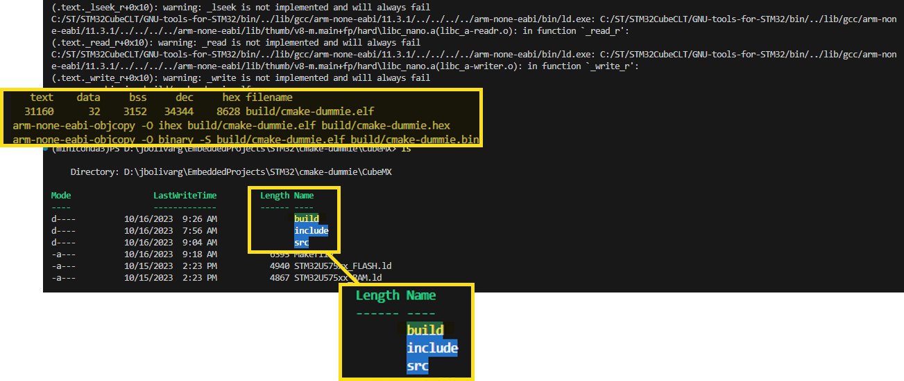

# Setup CMake Project

To convert the Make project on a CMake project some modifications needs to be done in the project's directory structure.

First create tow directories structures in the project's root directory, the *CubeMX* and the *Project* folders.

The *CubeMX* folder will contains the Make project files generated by **STM32CubeMX**, and the *Project* folder will contains the specific project files that implements the project's functionalities.

In the *c_cpp_properties.json* add the new paths to allow IntelliSense find the include files on this new locations.

## Isolate CubeMX Make project

Isolating the Make project generated by **STM32CubeMX** is helpful because this allow us verify if was a dependency error was introduced in the project.

The first step is move the MCU specific files into the *CubeMX* folder.

After moving the files the directory structure should be similar to this.

Remember this files are related to the MCU, because that the names are specific to the MCU used.

The paths in the *Makefile* must be adjusted to be relative to the new file location.

One last adjustment on the *Makefile* is on the **clean:** section, becuase it si generated to be run on Linux or Unix OS, it needs to be modified as show next to run on Windows environments.

After this adjustments, in the terminal, you move to the *CubeMX* folder and run the `make` command, a *build* folder will be created in the *CubeMX* directory and the STM32 project should be compiled without errors.

After verify that Makefile compile the project without any error, the command `make clean` can be used to eliminate the *build* folder created on the compilation.

