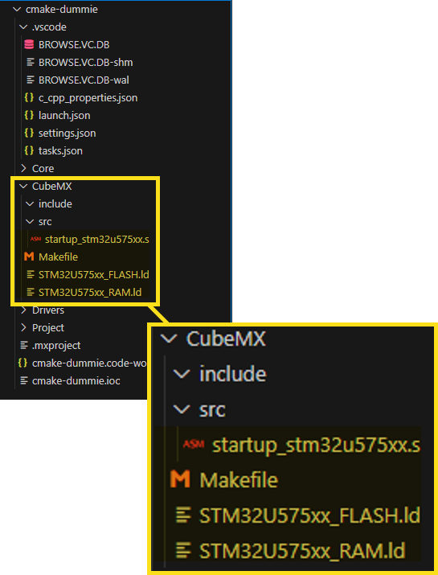

# Setup CMake Project

To convert the Make project on a CMake project some modifications needs to be done in the project's directory structure.

First create tow directories structures in the project's root directory, the *CubeMX* and the *Project* folders.

The *CubeMX* folder will contains the Make project files generated by **STM32CubeMX**, and the *Project* folder will contains the specific project files that implements the project's functionalities.

In the *c_cpp_properties.json* add the new paths to allow IntelliSense find the include files on this new locations.

## Isolate CubeMX Make project

Isolating the Make project generated by **STM32CubeMX** is helpful because this allow us verify if was a dependency error was introduced in the project.

The first step is move the MCU specific files into the *CubeMX* folder.

After moving the files the directory structure should be similar to this.

Remember this files are related to the MCU, because that the names are specific to the MCU used.

The paths in the *Makefile* must be adjusted to be relative to the new file location.

One last adjustment on the *Makefile* is at the **clean:** section, becuase it si generated to be run on Linux or Unix OS, it needs to be modified as show next to run on Windows environments.

After this adjustments, in the terminal, you move to the *CubeMX* folder and run the `make` command, a *build* folder will be created in the *CubeMX* directory and the STM32 project should be compiled without errors.

After verify that Makefile compile the project without any error, the command `make clean` can be used to eliminate the *build* folder created on the compilation.

## CMake Setup

To setup the project to be managed by **CMake** some scripts needs to be copied from the template to the new project and some adjustments needs to be do.

The files that need to be copied are the next four ones.

This four files are: 

- *gcc-arm-none-eabi.cmake* is the Crosscompiler toolchain setup.
- *Makefile* is a make script to generate CMake project's files structures.
- *mcu-flash.bat* is a windows' batch script to flash the STM32 MCU
- *CMakeLists.txt* is the CMake script to generate the MCU project.

To adjust the CMake project to the specific MCU to be used, some parameters need to be modified in the *CMakeLists.txt* file.

This values to setup the MCU can be found in the *Make* file that is in the *CubeMX* folder. Other reason to save the *Make* file generated by **STM32CubeMX**.

The last value `MCU_MEM_ADD` can be found on the MCU reference manual or more easy using the *SMT32CubeProgrammer* connected to the MCU by STLink and get the flash address start address.

## Build CMake Project

After this steps, the CMake project should be ready to be build, open a terminal on the workspace's root directory and run `make build` command and the CMake project should be generated and compiled.

If the command `make all` is executed, the CMake project should be generated, compiled and flashed to the MCU.

Following this procedure the **STM32CubeMX** Make project was converted to a CMake project for **Visual Studio Code**.

## Last Note

When compiling the code, at the end some warning are show, informing about some functions that are not implemented and always will fail.

This functions are related to the `stdio` library implementation, to fix this...

TODO: Finish the HowTo
