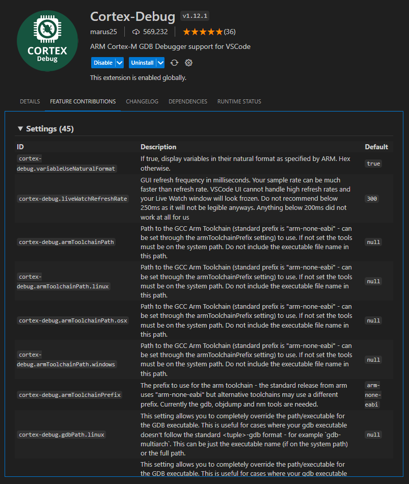
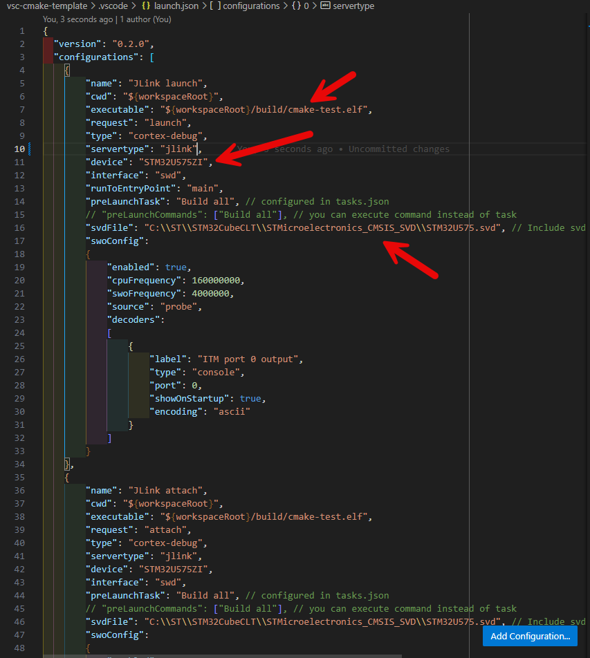
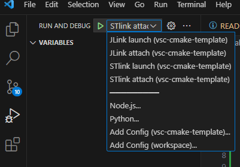

# Visual Studio Code Debug Setup

## Setup Cortex-Debug

Cortex-Debug extension provide Debugging support for ARM Cortex-M Microcontrollers on VSCODE.

Cortex-Debug have several settings, some of then will be setup in the *settings.json* file and others at the *launch.json* file.



### *settings.json* file Setup

In the *settings.json* file are specified project wide parameters:

```json
"cortex-debug.gdbPath": "C:\\ST\\STM32CubeCLT\\GNU-tools-for-STM32\\bin"
"cortex-debug.stlinkPath": "C:\\ST\\STM32CubeCLT\\STLink-gdb-server\\bin"
```

This configurations entries can be added at the *settings.json* file's end, or the file can be copied from the template to your *.vscode* folder.

### *launch.json* file setup

In the *launch.json* file are the device specific configurations parameters, is recommended copy this file from the template to your project and modify the device specific values on all the configurations.

In this file are four configurations, one "**launch**" and "**attach**" for every debugger, "**jlink**" and "**stlink**".

The difference between "**launch**" and "**attach**" is, "**launch**" compile and load the .elf file in the board and "**attach**" connect to the running process in the MCU, when using "**attach**" is important that running process is the same version that source code in project.



The "**svdFile**" is used by the Cortex-Debug extension to read the MCU's specific registers, because this it must used the specific file for the MCU family.

The "**executable**" must specify the .elf file in the *build* directory.

The "**device**" must specify the exact MCU device number.

## Debug project

To debug the project, on the VSCODE debug section the launch options are available and only needs to be selected.


