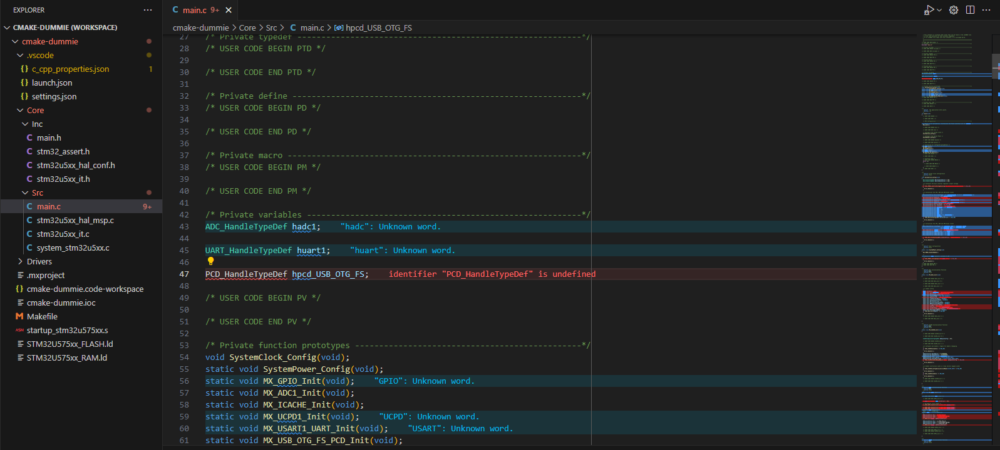
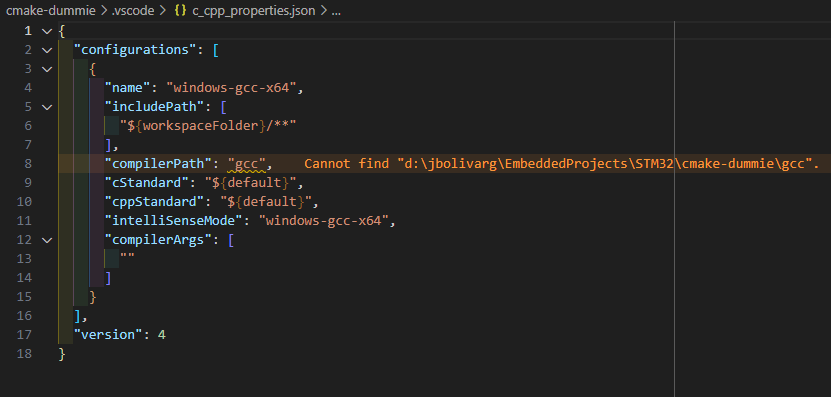
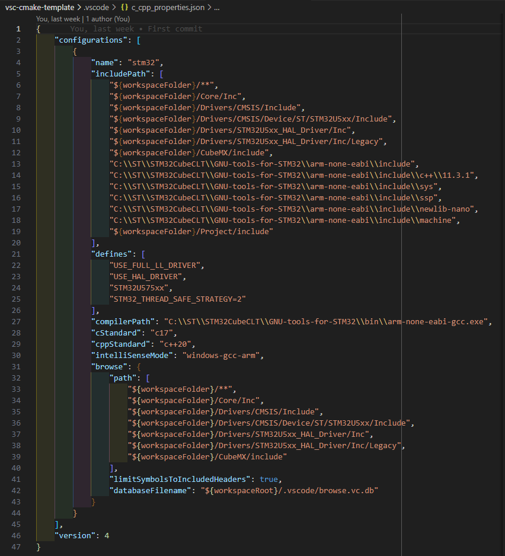
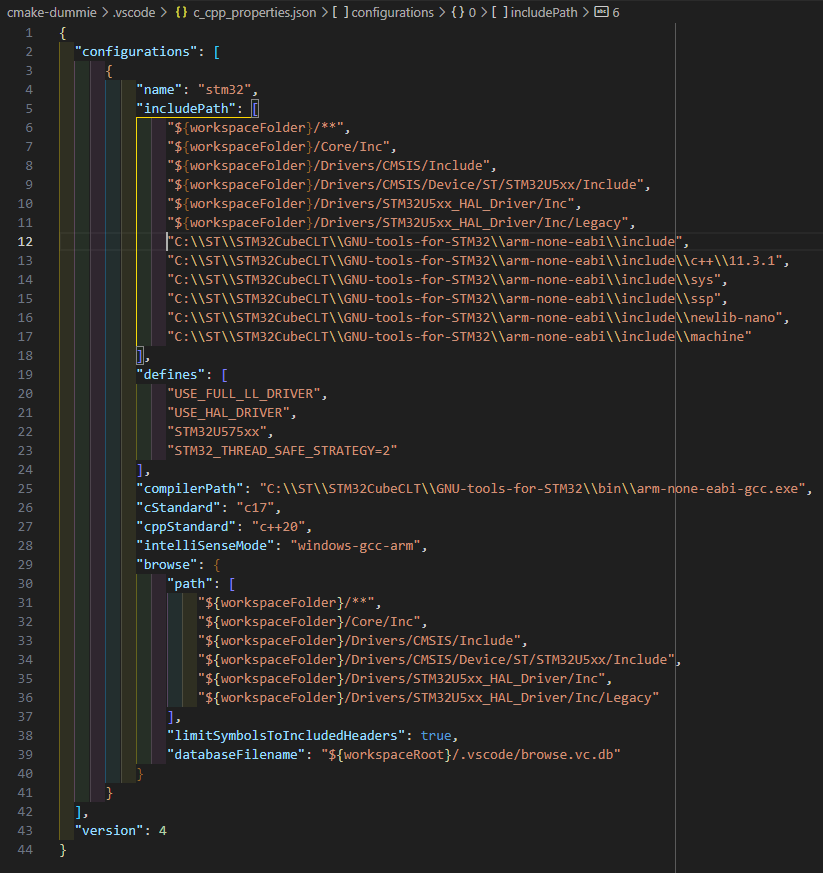
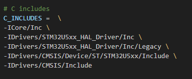
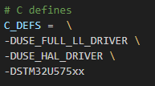
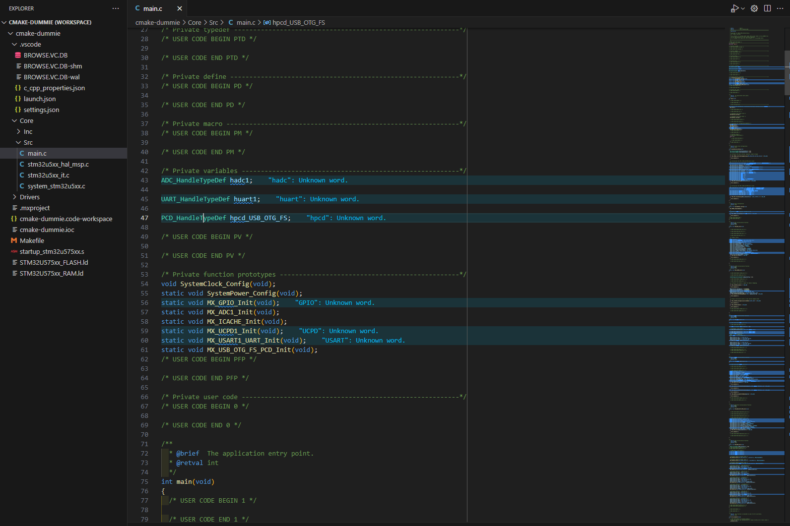
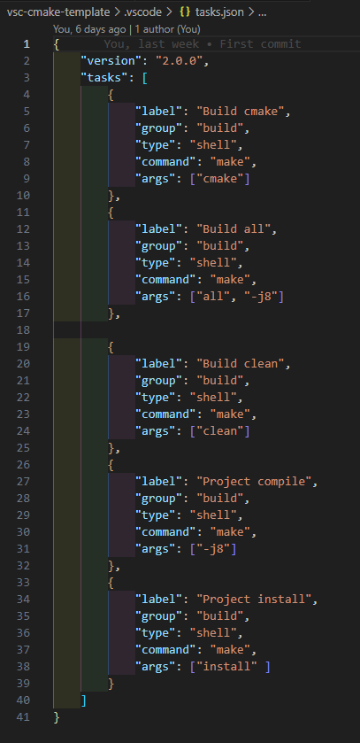
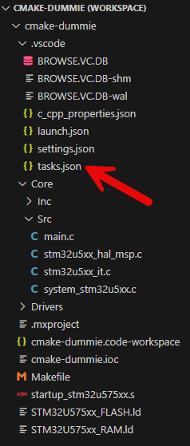

# Setup Visual Studio Code

## Fix IntelliSense Errors

When any code file is open on VSCODE, a lot of error will be show, this is because IntelliSense can't resolve the files location on the project.

To fix this, in the *.vscode* folder at *c_cpp_properties.json* file the paths needs to be included.

Comparing the *c_cpp_properties.json* file on the project and the one the template is easy to observe the differences on the setup:

*c_cpp_properties.json* file on the project

*c_cpp_properties.json* file on this repository template.

Copy the *c_cpp_properties.json* file template to the project and fix the paths where the header files are located on the project.

Additional on the *Makefile* created by STM32CubeMX you must verify the *include* directories and the preprocessor's macros *defines* specific for your project and include it on the *c_cpp_properties.json* file sections.

After the paths are fixed, when the source code file is open on VSCODE, all the errors gone and the references can be resolved by IntelliSense.

# Define Tasks

VSCODE allow define automated tasks to be executed on the environment using the `ctrl + Shift + B` shortcut; the tasks are defined in the *tasks.json* file at the *.vscode* folder.

Just copy the *tasks.json* file from the template to the *.vscode* folder in your project.

